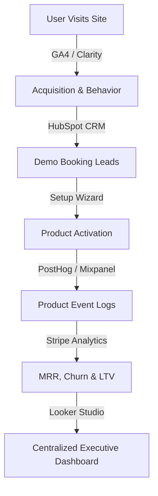

# Analytics Playbook & Platform Measurement Framework

This document outlines the telemetry, tracking KPIs, analytics stack, and cohort measurement frameworks for **ReviewManagement**.

---

## 1. The North Star Metric

Our primary success metric is: **Active Businesses Generating Reviews**.

* **Definition**: Any onboarded business profile with at least one active directory link (Google, Yelp, Facebook) that has sent a review request campaign OR generated/approved an AI review reply within the last 30 days.
* **Why it matters**: This metric captures actual product engagement and value delivery. Unlike simple registrations, it ensures the customer is actively managing their reputation, which correlates directly with trial conversions and low customer churn.
* **Formula**:
  $$\text{North Star Metric} = \frac{\text{Active Businesses (last 30 days)}}{\text{Total Onboarded Businesses}} \times 100$$
  * *Target Benchmark*: **> 82%** active engagement.

---

## 2. The Analytics Stack

We utilize a multi-layered telemetry stack to capture operations, marketing, and financial metrics:

* **Google Analytics 4 (GA4)**: Client-side traffic sources, registration conversions, and marketing landing page conversion rates.
* **Google Search Console (GSC)**: Keyword rankings, impressions, search CTR, and organic performance metrics.
* **Microsoft Clarity**: Visual session replays, heatmaps, and checkout form abandonment logs.
* **Stripe Analytics**: Subscription financial logs (MRR, ARR, upgrades, customer churn, LTV).
* **HubSpot CRM**: Pipeline management, demo request calls, and sales team assignments.
* **Looker Studio**: Unifies GA4, Stripe billing, and database usage statistics into one executive panel.
* **Future Stack**: Mixpanel, PostHog, and Amplitude for detailed user journey mapping and cohort event funnels.

---

## 3. Telemetry KPI Categorization

We group our product telemetry indicators into seven distinct analytical buckets:

### A. Acquisition Metrics
* **Monthly Unique Visitors**: Traffic arrivals per channel (Organic Search, Referral, Direct, Paid).
* **Demo Requests Conversion Rate**: percentage of visitors booking a demo call.
* **Trial Signup Conversion Rate**: percentage of visitors registering for a free trial.
* **Customer Acquisition Cost (CAC)**: Total sales/marketing spend divided by new trials acquired.

### B. Activation Metrics
To measure onboarding success, we monitor the 4-Step activation funnel:
1. **Google Business Profile Connected**: Hooking their first review platform directory.
2. **First Review Imported**: Pulling historic reviews into the unified inbox.
3. **First Review Request Sent**: Dispatching their first SMS/Email campaign invitation.
4. **First AI Reply Generated & Approved**: Auto-generating and publishing an AI review response.

### C. Subscription & Revenue Metrics
* **Monthly Recurring Revenue (MRR)** & **Annual Recurring Revenue (ARR)**.
* **Average Revenue Per Account (ARPA)**:
  $$\text{ARPA} = \frac{\text{Total Active MRR}}{\text{Total Active Subscriptions}}$$
* **Customer Lifetime Value (LTV)**:
  $$\text{LTV} = \frac{\text{ARPA}}{\text{Customer Churn Rate}}$$
* **Revenue by Subscription Plan**: Starter ($29), Growth ($79), Agency ($199), Enterprise ($999).
* **Revenue by Industry**: Restaurants, Healthcare, Retail, Professional Services, Home Services, Franchises.

### D. Churn & Retention Analytics
* **Customer Churn Rate**: percentage of active accounts cancelling subscriptions monthly.
* **Revenue Churn Rate**: percentage of MRR lost due to cancellations or downgrades monthly.
* **Cohort Retention Curves**: Monitoring monthly signup cohorts over 180 days to identify product friction drops.

### E. Product Usage Analytics
* **Total Reviews Imported**: volume of reviews fetched from APIs.
* **Campaign Invites Dispatched**: volume of SMS/Email requests sent.
* **AI Replies Generated & Published**: volume of AI responses utilized.
* **Physical Locations Connected**: Connections metrics for active storefronts.
* **PDF Reports Generated**: PDF performance exports by agencies.

### F. AI Usage Analytics & Profitability
* **Replies generated & Approval Rate**: Tracks draft utility (target > 90% approval).
* **AI Token Cost**: OpenAI API costs computed per generation (e.g. $0.002 per response).
* **AI Profit Margin**: Plan yields against API expenses.
* **AI Adoption Rate**: percentage of active clients using the AI reply module weekly.

---

## 4. Reporting Schedule

We execute our analysis across four operational intervals:

| Interval | Target Audience | Primary Focus | Key Outputs |
| :--- | :--- | :--- | :--- |
| **Daily** | Platform Engineers | System Uptime & API status | Database load charts, error logs, Stripe gateway checks |
| **Weekly** | Growth & Marketing | Weekly signups and activations | SMS campaign counts, GSC organic impressions, trial signups |
| **Monthly** | Executive Board | Financial performance & MRR growth | MRR/ARR charts, Customer Churn, LTV/CAC ratios, ARPA |
| **Quarterly** | Strategic Leadership | Long-term growth & Competitor SEO | Market share shifts, feature flag performance reviews, budget allocations |
