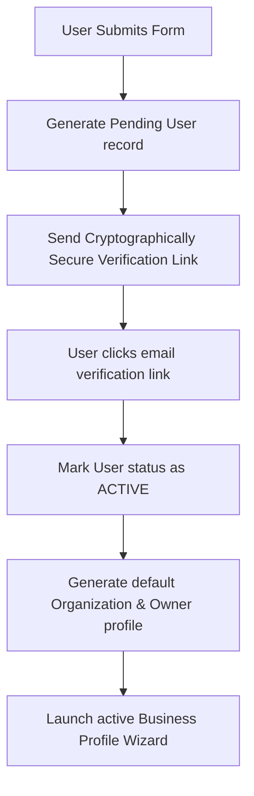

# Authentication & Security Playbook

This document defines the platform-wide identity management, access control matrix, session lifecycle policies, and compliance standards for the ReviewManagement SaaS application.

---

## 1. Security Vision & Core Principles

To safeguard tenant databases and protect business-customer relationships, we enforce:
* **Least-Privilege Access (PoLA)**: No role is granted access to assets or operations beyond their strict requirements.
* **Defense in Depth**: Layered security applied at infrastructure, network, database, application routing, and user interface levels.
* **Compliance Readiness**: Preparing audit records and lifecycle flows to meet GDPR, CCPA, and future SOC 2 Type II assurance requirements.

---

## 2. Authentication Strategy & Flows

The platform supports robust multi-tenant authentication protocols:

### 2.1 Identity Providers
* **Email & Password**: Standard credential authentication with complex password enforcement.
* **OAuth 2.0 (Google SSO)**: Secure integration for single-click sign-ons, caching user profile metadata (avatar, full name).
* **Future Enterprise SSO**: SAML 2.0 and OpenID Connect (OIDC) capability plans for corporate white-label instances.

### 2.2 User Registration Flow


### 2.3 Login & Session Flow
1. **Submit Credentials**: User provides email/password or authenticates via Google OAuth.
2. **Database Verification**: Credentials validated (using Argon2id hashes for email passwords).
3. **Token Generation**:
   * **Access Token**: Short-lived (15 minutes) JWT containing user identification, organization details, and role claims.
   * **Refresh Token**: Long-lived (7 days) secure cookie, saved with UUID reference in the Redis session registry.
4. **Dashboard Redirect**: User redirected to corresponding workspace based on client role mapping.

---

## 3. Password Security Policies

* **Hashing Algorithm**: Argon2id (or bcrypt with salt round work factor >= 12).
* **Complexity Requirements**:
  * Minimum 10 characters length.
  * Must contain at least one uppercase letter, one lowercase letter, one numeric digit, and one special character (e.g. `@`, `#`, `!`).
* **Verification / Token Expiring**: Password reset tokens expire strictly 1 hour from issuance.
* **Brute-Force Rate Limiting**: Limit of 5 failed login attempts per email/IP block within a rolling 15-minute window. Account status temporarily locked for 30 minutes if exceeded.

---

## 4. JWT (JSON Web Token) Strategy

* **Access Token Schema**:
  ```json
  {
    "sub": "usr_9f83a2b1-5e72-4d3c-9182-38ef4c1a2d3b",
    "email": "owner@acmepizza.com",
    "orgId": "org_71b9c2a3-2f41",
    "role": "owner",
    "iat": 1781212800,
    "exp": 1781213700
  }
  ```
* **Storage Rules**:
  * Access Tokens are stored in-memory (client JavaScript state) or inside temporary short-lived memory caches.
  * Refresh Tokens are transmitted strictly via `HttpOnly`, `Secure`, `SameSite=Strict` cookies to prevent Cross-Site Scripting (XSS) extraction.
* **Token Revocation**: Refresh tokens can be dynamically revoked by destroying their corresponding session record in Redis, instantly invalidating any subsequent attempt to fetch a new access token.

---

## 5. Role Based Access Control (RBAC)

The application supports 5 logical roles configured with hierarchical permission profiles:

| Role | Description |
|---|---|
| **Super Admin** | Platform owner. Accesses all administrative settings, analytics, support desk logs, and playbooks. |
| **Agency Admin** | Manage multiple organization client profiles, comparisons metrics, and tenant allocations. |
| **Business Owner** | Managing owner of a business entity. Has full control over billing, locations, and campaigns. |
| **Marketing User** | Campaign manager. Can manage customer contacts and trigger campaigns, but cannot modify billing. |
| **Read Only User** | Viewer. Can view metrics dashboards, report grids, and reviews list. Cannot modify or launch. |

---

## 6. Access Control & Permission Matrix

Permission scopes are checked at both frontend rendering wrapper level and backend route guard level:

| Permission Scope | Super Admin | Agency Admin | Business Owner | Marketing User | Read Only User |
|---|:---:|:---:|:---:|:---:|:---:|
| **View Dashboard** | ✓ | ✓ | ✓ | ✓ | ✓ |
| **Manage Businesses** | ✓ | ✓ | ✓ | ✗ | ✗ |
| **Manage Customers** | ✓ | ✓ | ✓ | ✓ | ✗ |
| **Launch Campaigns** | ✓ | ✓ | ✓ | ✓ | ✗ |
| **View Reports** | ✓ | ✓ | ✓ | ✓ | ✓ |
| **Manage Billing** | ✓ | ✗ | ✓ | ✗ | ✗ |

---

## 7. Session Management & Device Control

* **Automatic Inactivity Expiry**: Sessions expire after 120 minutes of continuous inactive payload states.
* **Device Registry**: Stores client user-agent strings, geolocation approximations, and IP hashes.
* **Multi-Device Logout**: Users can view all active logged-in device sessions and issue a dynamic `REVOKE` command targeting specific devices or all devices simultaneously.

---

## 8. Audit Logging Protocol

We maintain immutable audit trail logs for administrative and security actions. Each log must contain:
* `timestamp` (UTC)
* `actor_id` (User ID initiating action)
* `action` (Normalized event string, e.g. `auth.login`, `campaign.launch`, `billing.update`)
* `status` (`SUCCESS` / `FAILED`)
* `ip_address` & `user_agent`
* `details` (Contextual key-values describing modified resources)

### Audit Event Scopes
* **Auth**: Logins, logouts, password resets, failed credential blocks.
* **RBAC**: User role upgrades/downgrades, organization team member invites.
* **Billing**: Stripe plan subscriptions updates, invoice downloads.
* **Campaigns**: Triggers, templates modifications, lists attachments.

---

## 9. Data Protection & Cryptography

* **Encryption in Transit**: Strict enforcement of HTTPS/TLS 1.3 for all REST API, dashboard, and Webhook interfaces. HSTS header enabled.
* **Encryption at Rest**: Databases and Redis storage caches encrypted at rest using AES-256 block ciphers.
* **Database Backup Protection**: Nightly backups encrypted via GPG/AES-256 before transit to secure offline cloud repositories.

---

## 10. Compliance Readiness (GDPR / CCPA)

To align with consumer data privacy regulations:
* **Right to be Forgotten**: Implementation of a dynamic cascading data deletion workflow. Purges customer emails, phone numbers, and communication logs within 72 hours of verification request.
* **Consent Management**: Cookie consent managers and transactional message opt-out unsubscribe tags automatically injected.
* **Audit History Retention**: Security and audit logs preserved for a minimum of 1 year for compliance reviews.

---

## 11. Part 6 Deliverables Gate Checklist

* [x] Authentication architecture defined and approved
* [x] Role Based Access Control (RBAC) model approved
* [x] Audit logging formats and tracking defined
* [x] Session management & multi-device strategy documented
* [x] Security policies implementation-ready
