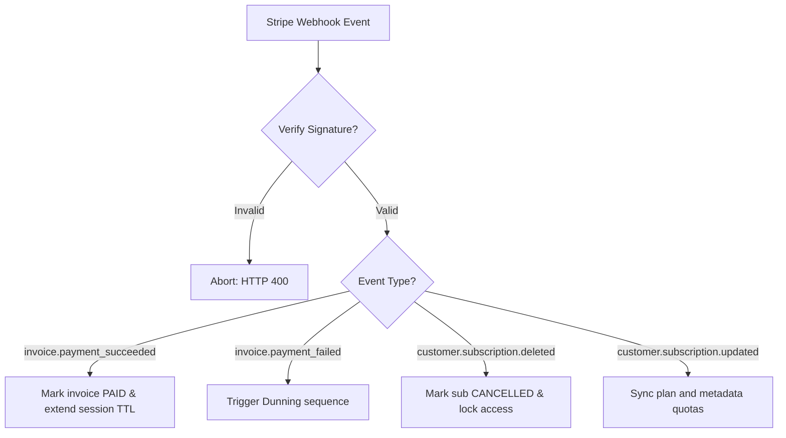

# Billing & Subscription Playbook

This document defines the integration specs, subscription lifecycles, usage tracking, dunning rules, and compliance standards for the platform's Stripe billing system.

---

## 1. Stripe Billing Architecture

We use Stripe Billing as our primary revenue operations ledger. The design supports multi-tenant SaaS structures at two tiers:
* **Direct Business Subscriptions**: Single organizations billing directly.
* **Agency Master Subscriptions**: Agencies subscribing to bulk packs and allocating business locations to their quota pool.

---

## 2. Subscription Plans Configuration

We offer four standard tiers, billable on monthly or annual schedules (with a **20% discount** applied to annual pricing):

| Plan | Price (Monthly) | Active Location Limits | Review Request Invites / Month | SMS Invites Included |
|---|---|---|---|---|
| **Starter Plan** | $29 / mo | 1 Location | 500 requests | 50 SMS |
| **Growth Plan** | $79 / mo | 3 Locations | 2,500 requests | 250 SMS |
| **Agency Plan** | $299 / mo | Unlimited Locations | 15,000 requests | 1,500 SMS |
| **Enterprise Plan** | Custom | Negotiated | Custom | Custom |

---

## 3. Onboarding & Trial Management

* **14-Day Free Trial**: Automatically active upon organization sign-up without requiring a credit card initially.
* **Trial Expiration Daemon**: A daily background cron job scans database rows where `trial_end` has passed.
* **Upgrade Prompt Rules**: Action prompts appear on the dashboard header **3 days** prior to trial expiry.
* **Trial Expired Lock**: If the trial expires without a plan selection, user roles are temporarily restricted to read-only, and campaign execution engines are disabled.

---

## 4. Upgrades, Downgrades & Prorations

* **Proration Policy**: Upgrades are calculated instantly via Stripe's prorated invoice items, granting immediate access to higher limits. Downgrades are scheduled to execute at the **end of the active billing period** to prevent credit disputes.
* **Downgrade Limit Checks**: The customer dashboard must block downgrades if active locations or request history exceed the target plan limits (e.g. attempting to downgrade from Growth to Starter while managing 2 locations).

---

## 5. Webhook Ingestion Pipeline

All payment state updates are captured via Stripe webhooks. The webhook endpoint must validate requests using Stripe's official signature SDK checks.



---

## 6. Usage Tracking & Plan Enforcement

To ensure billing integrity, location usage limits are audited in real-time:
* **Metric Counter**: Requests sent, SMS counts, and email counts are updated dynamically.
* **Auditing Rule**: The campaign dispatcher must execute a quota check query:
  ```sql
  SELECT requests_sent, sms_sent 
  FROM usage_metrics 
  WHERE organization_id = :orgId AND billing_cycle_start <= NOW()
  ```
* **Lockout Enforcement**: If quota is exceeded, the request is rejected with a quota limit warning, suggesting an upgrade.

---

## 7. Failed Payments & Dunning Logic

When `invoice.payment_failed` is captured:
1. **Retry Strategy**: Stripe Smart Retries auto-attempts charging the payment method up to 4 times over 3 weeks.
2. **Dunning Alerts**: The user is notified immediately via email on failure with a billing update portal link.
3. **Grace Period**: Accounts remain active during a **7-day grace period**.
4. **Suspension**: If payment fails after the 4th attempt, the subscription is marked as `past_due`, and campaign dispatches are suspended.

---

## 8. Coupon & Referral Systems

* **Stripe Coupons**: Supports percentage discounts (e.g. `10% off`) and flat discounts (e.g. `$10 off`) configured in Stripe and passed during checkout sessions.
* **Referral Rewards**: Referral sign-ups credit the referrer with a $20 flat discount applied directly to their next billing invoice item.

---

## 9. Security & PCI Compliance

* **PCI DSS Compliance**: Handled entirely through Stripe Elements (custom styled inputs hosting Stripe iframe sessions).
* **Zero Credit Card Storage**: No card numbers, CVVs, or expiration dates are stored in ReviewManagement databases. Only Stripe customer IDs (`cus_...`) and payment method token IDs (`pm_...`) are saved.
* **Webhook Replay Prevention**: Webhook payloads are logged with Stripe's unique signature timestamp to prevent request replays.

---

## 10. Part 9 Deliverables Gate Checklist

* [x] Stripe architecture and endpoints approved
* [x] Subscription lifecycle states documented
* [x] Usage tracking quota enforcement rules approved
* [x] Revenue Operations MRR metric calculations defined
* [x] Billing implementation ready for integration
