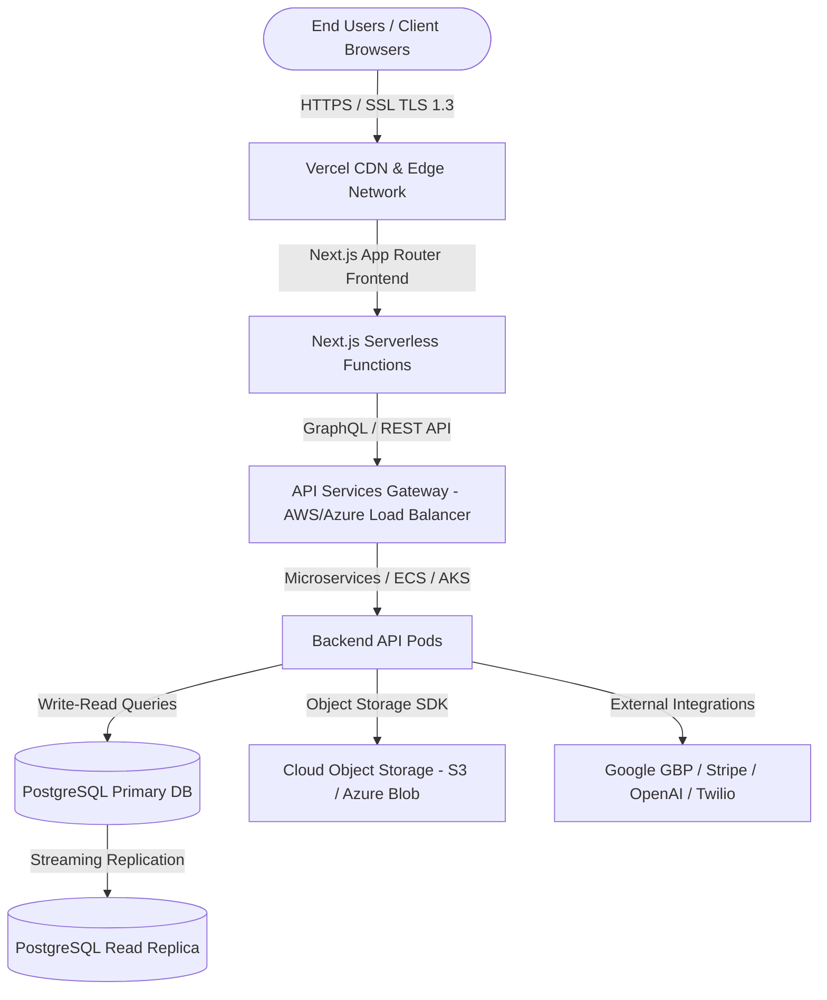

# Deployment Playbook, Infrastructure Architecture & CI/CD Operations

This document establishes the official DevOps, hosting, and database management standards for the **ReviewManagement** SaaS platform. It details the infrastructure architecture, environment isolation guidelines, database backups, monitoring stacks, incident response protocols, and rollback mechanisms.

---

## 1. Infrastructure Architecture

The platform uses a cloud-native, high-availability architecture split between standard SaaS serverless setups and optional Enterprise private cloud hosting.



### Hosting Standards
* **Primary (SaaS)**: **Vercel** is the system of record for the Next.js frontend, utilizing edge middleware and serverless APIs to maximize global delivery speeds.
* **Optional Enterprise (Private Cloud)**: **AWS (Amazon Web Services)** or **Microsoft Azure** for enterprise customers requiring dedicated VPCs, container orchestration (ECS/EKS/AKS), and localized data residency.
* **Infrastructure Requirements**:
  * **Auto Scaling**: Automatically scales CPU/Memory capacity based on concurrent users, targeting a scale-up trigger at 70% CPU usage.
  * **Environment Isolation**: Separate networks, storage buckets, and DB clusters. No development instances share resources with production.
  * **SSL Everywhere**: Enforce TLS 1.3. Custom SSL certificates are auto-renewed via Let's Encrypt or AWS Certificate Manager.
  * **Monitoring**: Global dashboards and agent-based system logs are configured in all environments.

---

## 2. Environment Management & Secrets Isolation

ReviewManagement maintains three distinct environments with strict access isolation boundaries:

| Environment | Purpose | Database | API Endpoint | Access Control |
| :--- | :--- | :--- | :--- | :--- |
| **Development** | Sandbox feature testing and developer iterations. | `dev-postgres-instance` | `api.dev.reviewmanagement.com` | Developers & QA |
| **Staging** | Pre-production release validation and QA smoke tests. | `staging-postgres-replica` | `api.staging.reviewmanagement.com` | Developers, QA, PMs |
| **Production** | Live tenant usage and business-critical operations. | `prod-postgres-cluster` (HA) | `api.reviewmanagement.com` | Super Admins (DevOps) |

### Secrets and API Keys Management Rules
1. **Separate Secrets**: Environment variables must never be shared across environments. For example, Stripe and OpenAI development keys are restricted to `development`, and live keys are loaded into `production` vault storage.
2. **Secrets Storage**: Secrets are injected at runtime using secure key vaults (e.g., AWS Secrets Manager, Vercel Environment Variables, Azure Key Vault). 
3. **No Local Hardcoding**: No plaintext credentials or configuration variables are permitted in the repository.
4. **Key Rotation**: Production credentials (e.g., Stripe, Twilio, OpenAI tokens) must be rotated every **90 days** or immediately following a suspected security leak.

---

## 3. CI/CD Pipeline Workflow

Our continuous integration and continuous deployment (CI/CD) pipelines enforce multiple validation steps prior to shipping any build to production.

```
[Developer Commit] ➔ [Pull Request] ➔ [Automated Checkpoints] ➔ [Peer Code Review] ➔ [QA Approval] ➔ [Deploy]
```

### Pipeline Validation Checkpoints
Every Pull Request targeting `main` or `release/*` must pass four automated pipeline steps:

1. **Linting**: Execution of ESLint rules and Prettier formats to ensure codebase formatting uniformity.
   ```bash
   npm run lint
   ```
2. **Unit & Integration Tests**: All unit tests must pass with a minimum of **80% code coverage** required.
   ```bash
   npm run test
   ```
3. **Security Scans**: Static Application Security Testing (SAST) using tools like NPM Audit, Snyk, or GitHub Dependabot to identify vulnerable packages.
   ```bash
   npm audit --audit-level=high
   ```
4. **Build Validation**: The production build bundle must compile successfully.
   ```bash
   npm run build
   ```

---

## 4. Database Operations & Backup Policy

To guarantee **zero-data-loss** deployments, database administrators must adhere to the following backup schedules and disaster recovery protocols.

### Backup Schedule
* **Daily Full Backups**: Automated SQL dumps executed every night at 02:00 UTC.
* **Point-in-Time Recovery (PITR)**: Write-Ahead Logs (WAL) are continuously archived to Cloud Object Storage, enabling database restoration to any second within the retention window.
* **Retention Period**: All backup snapshots and WAL logs must be retained for a **minimum of 30 days** to comply with financial and compliance regulations.

### Backup Validation & Recovery Testing
* **Validation**: Daily backup completeness is monitored automatically. If a backup file size is 0 bytes or the cron fails to complete within 30 minutes, an alert is triggered.
* **Quarterly Recovery Testing**: Once every quarter, DevOps engineers must simulate a database failure by restoring a production snapshot to a clean, isolated staging cluster. Uptime integrity and restore speed are logged.

---

## 5. Monitoring, Observability & Analytics

A continuous monitoring platform tracks application performance and third-party API connectivity in real time.

### Key Metrics Tracked
* **Application Health**: Memory leaks, Next.js edge runtime execution logs, and client-side web vitals (LCP, FID, CLS).
* **API Health**: Latency profiles and response status codes. Any surge in HTTP 5xx responses triggers alert escalations.
* **Database Health**: Active connections count, slow queries (>200ms execution time), and IOPS bottlenecks.
* **Review Sync Status**: Success rates of Google Business Profile API sync tasks, highlighting delayed token synchronizations.
* **Billing Events**: Webhook response codes from Stripe, capturing subscription creation, upgrades, and failed renewals.
* **AI Usage Analytics**: Track OpenAI token usage per organization, API cost tracking, and response approval ratios.

### Observability Tools Stack
* **Monitoring & Logs**: Looker Studio, Looker, AWS CloudWatch, Datadog.
* **Alerting**: PagerDuty, Slack DevOps integrations, and Twilio SMS escalations.
* **Error Tracking**: Sentry, LogRocket, or Highlight.io for tracing frontend JS exceptions.

---

## 6. Security Operations & Protocols

ReviewManagement implements industry-standard security frameworks to protect enterprise reputation assets.

* **Multi-Factor Authentication (MFA)**: Enforced for all Super Admins, DevOps engineers, and organization accounts.
* **Encryption at Rest**: Databases, storage volumes, and file assets are encrypted using **AES-256 GCM**.
* **Encryption in Transit**: All public connections require HTTP over TLS 1.3. HTTP Strict Transport Security (HSTS) is active.
* **Audit Logging**: All administrative changes (such as changing user permissions, editing billing tiers, or viewing customer data) are captured in immutable system logs.
* **Least Privilege Access**: Access control is restricted via Role-Based Access Control (RBAC). Developers do not have access to production databases or payment credentials.
* **Monthly Security Reviews**: Internal security reviews are conducted monthly to review access audits, dependency updates, and penetration test logs.

---

## 7. Incident Response & P1 Outage Escalation

Critical events are categorized by severity levels to streamline debugging efforts and minimize customer impact.

### Incident Severity Levels

| Severity | Definition | Example Scenario | Immediate Action |
| :--- | :--- | :--- | :--- |
| **P1 Critical** | Platform is entirely down or core data is inaccessible. | Database crash, primary SSL cert expiration, authentication gate failure. | **Immediate Escalation**. PagerDuty rings DevOps. Staging-wide incident room initialized. |
| **P2 Major** | A major feature is broken but the platform is online. | Google Review import syncing fails, AI reply generator times out, billing webhook fails. | Escalated to development leads. Expected fix within **4 hours**. |
| **P3 Minor** | A non-critical UI issue or visual glitch. | Dashboard layout alignment issue, export analytics PDF button takes long. | Logged in Jira backlog. Fixed in next regular release. |

### P1 Escalation Process
1. **Detection**: Uptime monitoring detects a service outage and automatically calls the on-call engineer via PagerDuty.
2. **Triage**: Engineer identifies the root cause (e.g., bad deployment, server overload, database crash).
3. **Escalation Loop**:
   * **DevOps Lead** notified within 10 minutes of outage.
   * **Customer Support Lead** notified to update the public Status Page.
   * **Staging room** created for active hot-fixing.
4. **Resolution**: Apply fix or trigger **Immediate Rollback**.

---

## 8. Rollback Strategy

If a release introduces a critical bug (P1) or a security vulnerability, the DevOps team triggers the rollback strategy.

### Rollback Triggers
* **Failed Release**: Deployment compile error on production nodes.
* **Critical Bug (P1)**: Production database corruption or payment flow blockage detected post-release.
* **Security Incident**: Suspected token leak or breach requiring immediate environment lockout.

### Rollback Execution Process
1. **Restore Previous Stable Version**: Rollback the frontend container in Vercel/AWS to the previous tagged git release (e.g., `git revert` or container rollback).
2. **Database Reversion**: Run database migration rollback scripts if a schema change occurred.
3. **System Validation**: Perform immediate automated smoke tests to confirm platform recovery.
4. **Stakeholder Notification**: Send system status updates to customers and update internal dashboards.
5. **Monitor Stability**: Observe logs for 30 minutes following rollback to guarantee memory and connection loads normalize.

---

## 9. Part 12 Deliverables Gate Checklist

To exit Part 12 and verify DevOps operations readiness, the following milestones must be signed off:

* [ ] **DevOps hosting architecture approved**: Verify that edge routing (Vercel CDN) and serverless databases (PostgreSQL, Redis) are correctly mapped.
* [ ] **Secrets and environment vault configured**: Ensure that API keys (Stripe, Twilio, OpenAI) are safely sharded and vault rotation mechanisms are functional.
* [ ] **Automated daily backups verified**: Establish automated nightly backup crons and test the point-in-time recovery WAL log replayer.
* [ ] **Incident escalation protocols documented**: Verify that P1/P2 outage routing loops and Slack status alerts are operational.
* [ ] **Production rollback tags configured**: Maintain active tags (v1.4.2-stable) and test automated git container rollbacks.
