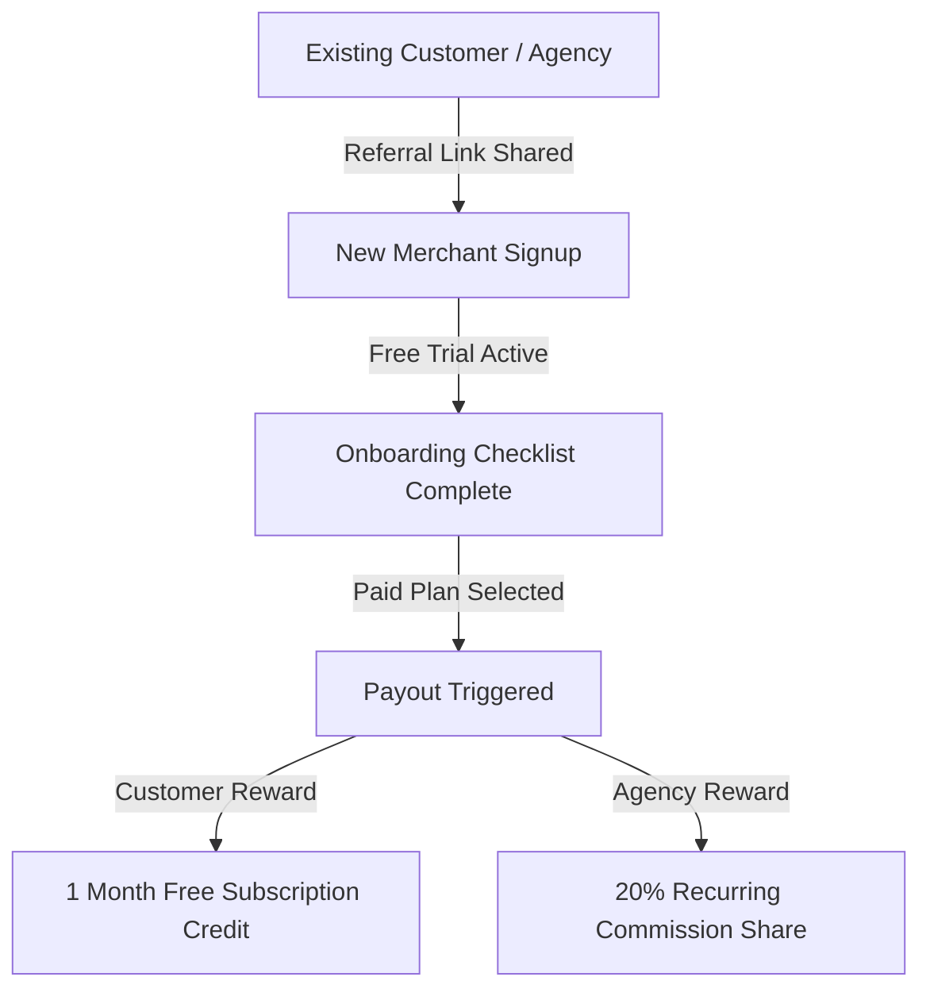

# Growth & Scaling Playbook

This document details the Growth & Scaling strategy, Multi-channel Customer Acquisition model, Agency Partner program, SEO & Content pipelines, Scaling Infrastructure architecture, and Hiring Milestones for the **ReviewManagement** SaaS platform.

---

## 1. Growth Vision

Our long-term business strategy focuses on building a highly scalable, recurring revenue engine, positioning ReviewManagement as the reputation management platform of choice.

* **Key Objectives**:
  * **SaaS Recurring Revenue**: Establish stable MRR streams via tiered subscription products.
  * **Customer Acquisition Engine**: Build repeatable inbound/outbound sales and marketing loops to minimize CAC.
  * **Scale Cleanly**: Minimize operational overhead increases as tenant volumes expand through automated self-onboarding and AI support.

---

## 2. Customer Acquisition & Referral Engines

### Customer Acquisition Channels
1. **LinkedIn Outreach**: Automated, highly personalized outbound campaigns targeting regional business managers, franchise owners, and marketing leads.
2. **Local Business Prospecting**: Founder-led cold outreach and demo pitches highlighting local SEO gaps and review volume shortages.
3. **Referral Programs**: Incentivizing existing merchants to refer neighboring local businesses.
4. **SEO-Driven Inbound**: Generating high-intent organic search leads via review management keyword hubs.
5. **Strategic Partnerships**: Co-selling integrations with local business software (e.g. scheduling/CRM platforms).

### Referral Growth System


* **Customer Incentives**: Both referrer and referee receive **1 month free** of the Growth plan ($79 value) once the referee converts to a paid subscription.
* **Agency Incentives**: 20% recurring revenue share for every referred merchant active on paid plans.
* **Tracking**: Track referral attribution, coupon applications, and commissions payouts via Stripe and HubSpot integrations.
* **Automated Campaigns**: Trigger in-app prompts and post-review sync congratulations emails prompting users to share their referral links.

---

## 3. Agency Partner Program

To accelerate multi-location customer acquisition, we partner with digital marketing and SEO agencies:

* **Agency Onboarding Process**: Kickoff sync, custom domains routing setup, whitelabel brand customizations (logos, colors, email senders).
* **White-Label Roadmap**:
  * *Phase 1*: Whitelabel dashboard colors, logos, and custom SMTP email senders.
  * *Phase 2*: Scoped sub-account widgets and custom domains routing (e.g. `reviews.youragency.com`).
  * *Phase 3*: Custom sub-agency billing and client pricing control toggles.
* **Agency-Specific Pricing**: Custom multi-location packs (e.g. $199/mo for up to 10 locations, $399/mo for up to 25 locations).
* **Co-Marketing**: Joint webinars, local business SEO guides, and guest articles.

---

## 4. Content Marketing & SEO Growth Plan

### Content Marketing Strategy
* **Weekly Blog Publishing**: Target topics on local business reputation, Google Maps SEO tips, and customer feedback.
* **Case Studies**: Publish conversion statistics from active Closed Beta and early Growth plan clients.
* **Industry Reports**: Annual local search ranking studies showing the correlation between review count/velocity and local map ranking.
* **Customer Success Stories**: Case study videos highlighting local businesses saving hours via AI replies.

### SEO Growth Plan
* **Local SEO**: Target keywords matching local service search patterns (e.g., "how to get Google reviews for dentists in Chicago").
* **Review Keywords**: Optimize pages for "review management software", "whitelabel reputation management", and "automated review replies".
* **Location Landing Pages**: Deploy directory pages for target geographic markets.
* **Backlink Development**: Write guest posts for SEO agency blogs and business software review sites.
* **Technical SEO**: Guarantee fast edge response times (<150ms) on Next.js frontend, enforce semantic HTML structure, and generate automated sitemaps.

---

## 5. Revenue Expansion Strategy

Maximize customer lifetime value (LTV) through four primary expansion pipelines:

* **Tier Upgrades**: Nudge Starter ($29/mo) users to upgrade to Growth ($79/mo) as locations or AI reply limits are reached.
* **Annual Contracts**: Offer a 20% discount on annual plans to capture upfront cash and improve retention.
* **Location Add-ons**: Charge an incremental $15/mo for every additional physical location connected under standard plans.
* **Premium Support Offerings**: Sell dedicated CSM services, custom templates, and onboarding setups to enterprise clients.
* **AI Feature Packs**: Offer premium advanced GPT-4 tonality models or auto-reply capabilities as paid add-ons.

---

## 6. Scaling Architecture & Infrastructure

To support high multi-tenant loads, engineers must enforce the following scaling standards:

* **Multi-Tenant Isolation**: Row-level security (RLS) policies in PostgreSQL, guaranteeing merchants only access their scoped locations.
* **Database Scaling**: Implement read replicas for heavy review-fetching queries. Database connections are managed via PgBouncer.
* **Queue Scaling**: Offload review importing and email dispatch tasks to Redis-backed Vercel Key-Value workers, throttling API calls to prevent Twilio/Google API rate limit blocks.
* **Performance Optimization**: Statically render marketing pages, compress image uploads, and leverage Vercel's global Edge CDN caching.

---

## 7. Hiring Milestones

Scale support and development teams based on recurring revenue and customer limits:

```
[100 Customers] ➔ [Hire Customer Success Manager]
[$10K MRR]      ➔ [Hire Sales Representative]
[$15K MRR]      ➔ [Hire Second Developer]
[$25K MRR]      ➔ [Hire Operations Manager]
```

1. **Customer Success Manager (CSM)**: Hired at **100 customers** to manage onboarding queues, QBRs, and support logs.
2. **Sales Representative**: Hired at **$10K MRR** to qualify inbound demo leads and drive local outreach calls.
3. **Second Developer**: Hired at **$15K MRR** to build advanced integrations and optimize database scaling.
4. **Operations Manager**: Hired at **$25K MRR** to streamline billing, vendor relationships, and hiring.

---

## 8. Growth KPIs & Metrics

Success will be tracked against five primary indicators:
* **MRR Growth Rate**: MoM revenue expansion (Target: >15% monthly growth).
* **Customer Acquisition Cost (CAC)**: Sales and marketing spend divided by conversions (Target: <$150/customer).
* **Customer Lifetime Value (LTV)**: Projected revenue value per subscriber lifecycle (Target: >$1,500/customer).
* **Referral Rate**: Percentage of new signups coming from referral codes (Target: >10% of new users).
* **Net Revenue Retention (NRR)**: Total MRR retained including upgrades, divided by starting MRR (Target: >110% yearly).

---

## 9. 12 & 24-Month Vision

* **12-Month Milestone Targets**:
  * Acquire **100+ active paying customers**.
  * Reach **$10K+ MRR** (arranger of $120k ARR run-rate).
  * Build a network of **10+ active whitelabel SEO agencies**.
  * Establish documented support, DevOps, and sales SOP playbooks.
* **24-Month Vision**:
  * Scale to **500+ active customers**.
  * Reach **$50K+ MRR** ($600k ARR run-rate).
  * Fully automated multi-channel self-serve inbound acquisition engine.
  * Specialized operations team (sales, support, dev).

---

## 10. Part 14 Deliverables Gate Checklist
To declare Growth & Scaling readiness, the following gates must be approved:

* [ ] **Growth strategy approved**: Confirm LinkedIn, direct sales, and SEO acquisition channels are operational.
* [ ] **Referral system documented**: Verify customer and agency referral codes systems are active in billing models.
* [ ] **Agency program defined**: Map whitelabel features and pricing slots.
* [ ] **Revenue expansion plan approved**: Finalize locations add-on pricing and annual discount models.
* [ ] **Scaling blueprint finalized**: Confirm PostgreSQL pooling and worker queue setups are ready for heavy loads.
