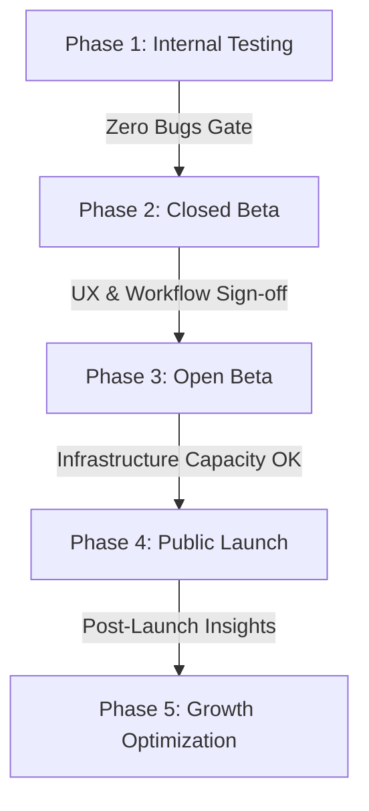

# Go-To-Market & Launch Playbook

This document details the Go-To-Market (GTM) strategy, beta programs, early customer acquisition initiatives, and readiness checklists for the **ReviewManagement** SaaS platform.

---

## 1. Launch Vision

Our primary GTM goal is to transition from an MVP environment into a repeatable, high-growth, revenue-generating SaaS engine.

* **SaaS Launch Objectives**:
  * **Secure Paying Customers**: Convert early beta participants and trial leads into active paying subscribers to prove pricing validation.
  * **Validate Product-Market Fit (PMF)**: Gather organic usage data to confirm value props (e.g., automated AI review replies, multi-location review monitoring).
  * **Build Referral Loops**: Turn first-generation customers into promoters via case studies and incentives to lower customer acquisition cost (CAC).
  * **Minimize Churn**: Ensure onboarding flow triggers high activation within the first 14 days.

---

## 2. Launch Phases

The rollout is divided into five incremental phases to isolate issues, refine workflows, and scale the load safely.

### Phase 1: Internal Testing
* **Target Audience**: Founders, internal developers, product managers.
* **Core Activities**:
  * Self-onboard dummy merchant accounts.
  * Test Stripe checkouts, subscription cancellations, and webhook retry triggers.
  * Verify SMS dispatcher queue logs and email template responsiveness.
  * Audit security logs, encryption gates, and system access scopes.

### Phase 2: Closed Beta Program
* **Target Audience**: 5 to 10 hand-selected local businesses (e.g., dental clinics, retail shops, restaurants).
* **Core Activities**:
  * Offer free or highly discounted service in exchange for deep feedback.
  * Conduct founder-led onboarding sync sessions.
  * Track daily feature adoption metrics (e.g., AI replies generated, review requests sent).
  * Hold weekly feedback calls to discover UX friction and code bugs.

### Phase 3: Open Beta Program
* **Target Audience**: 25 to 50 businesses, including small agency clients.
* **Core Activities**:
  * Open self-serve registrations under a locked coupon/beta code system.
  * Monitor self-onboard activation conversion ratios.
  * Validate pricing tier assumptions (Starter vs. Growth).
  * Send first Net Promoter Score (NPS) surveys to establish a satisfaction baseline.

### Phase 4: Public Launch
* **Target Audience**: General market, agencies, SMB owners.
* **Core Activities**:
  * Complete domain redirects and index marketing landing pages on search engines.
  * Deploy founders' LinkedIn campaign announcements and social media rollouts.
  * Activate cold email campaigns targeting local leads databases.
  * Launch the Customer Referral program to incentivize organic growth.

### Phase 5: Growth Optimization
* **Target Audience**: All active users.
* **Core Activities**:
  * Review aggregated cohort retention models and platform usage indexes.
  * Prioritize feature backlogs based on recurring customer requests.
  * Update product roadmaps to refine multi-location syncing and advanced reporting.

---

## 3. First 100 Customers Plan

Acquiring the first 100 customers requires manual, non-scalable outreach paired with strategic partnerships.

1. **Local Business Outreach**:
   * Conduct in-person visits and cold calls to local businesses with poor or low review counts.
   * Provide a free "Google Review Assessment" showing missed revenue opportunities.
2. **Agency Partnerships**:
   * Offer marketing and SEO agencies a discounted multi-location "Agency Starter" package.
   * Highlight the benefit of unified white-labeled reports to ease client reporting loops.
3. **Referral Incentives**:
   * Reward existing merchants with 1 month free for every business they refer that signs up for a paid plan.
4. **Case Study Marketing**:
   * Document successful reviews-boosting case studies from Closed Beta clients and share them across local business communities.
5. **Founder-Led Sales**:
   * Founders conduct direct outreach and live demo calls, ensuring close contact with early feedback.

---

## 4. Sales & Marketing Launch Checklists

Before authorizing the public launch, both checklists must be 100% completed.

### Sales Launch Checklist
* [ ] **Proposal Templates Ready**: Sleek, white-labeled sales presentations and contract templates.
* [ ] **Demo Environment Available**: Active mock account prepopulated with reviews, campaigns, and reports.
* [ ] **Pricing Finalized**: Verification of Stripe pricing IDs and subscription plans.
* [ ] **CRM Configured**: Setup of sales pipelines and lead stages (e.g., HubSpot / CRM dashboard).
* [ ] **Sales KPIs Defined**: Targets set for call-to-demo conversion rates, contract value, and sales cycle duration.

### Marketing Launch Checklist
* [ ] **Landing Pages Published**: Main pricing page, features directories, and clinic/retail industry pages.
* [ ] **Content Calendar Active**: Scheduled blog posts and social updates addressing local SEO best practices.
* [ ] **Case Studies Available**: At least 2 verified reviews expansion case studies with real data.
* [ ] **Email Sequences Configured**: Dynamic sequences for trial onboarding, upgrade prompts, and dunning alerts.
* [ ] **Analytics Tracking Enabled**: Implementation of tracking tags (e.g., Google Analytics, custom usage counters).

---

## 5. Launch KPIs & Metrics

Success will be measured against five key metrics:

* **Trial Signups**: Total volume of new trials created (Target: 15+ per week during launch month).
* **Customer Conversion Rate**: Percentage of trials that transition to paid subscriptions (Target: >15% conversion).
* **Monthly Recurring Revenue (MRR)**: Track target expansions toward the $10,000 MRR milestone.
* **Customer Retention**: Goal of <5% monthly subscriber churn.
* **Net Promoter Score (NPS)**: Target customer satisfaction rating of >50.

---

## 6. Post-Launch Review Framework

At the end of every sprint post-launch, the product and growth teams conduct a structured review:

1. **Metrics Audit**: Compare actual conversion rates and signups against launch targets.
2. **User Feedback Review**: Review all customer support tickets and NPS comments.
3. **Roadmap Priority Tuning**: Move highly requested features (e.g., custom domains, API access) up the sprint backlog.
4. **Acquisition Channel Evaluation**: Focus budget on top-performing outreach channels (e.g., local visits vs. cold email sequences) and adjust sales targets.

---

## 7. Deliverables Gate Checklist
To declare GTM execution readiness, the following milestones must be signed off:

* [ ] **Launch checklist completed**: Confirm both Sales and Marketing readiness checklists are complete.
* [ ] **Beta program executed**: Verify Closed Beta runs are done and Open Beta scaling limits are validated.
* [ ] **Marketing assets prepared**: Landing pages, blog content, and onboarding email sequences are live.
* [ ] **Sales assets prepared**: Proposal decks, finalized pricing tiers, and demo environments are online.
* [ ] **Public launch approved**: Super admin authorization for public campaigns deployment.
