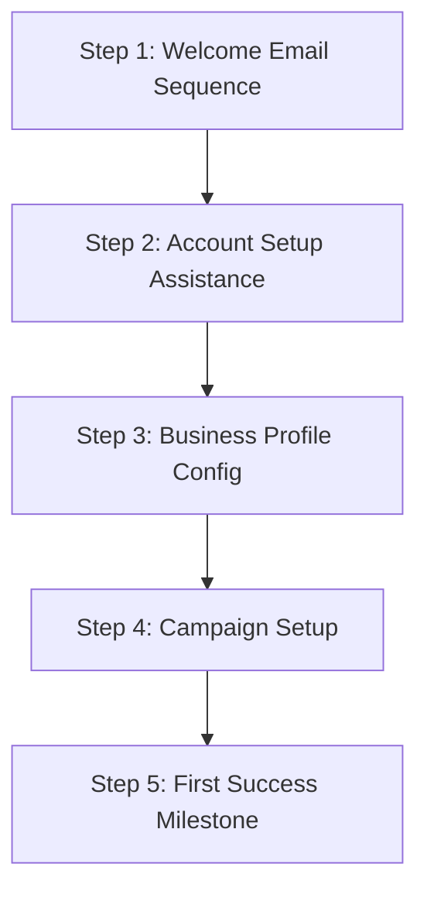

# Customer Success & Operations Playbook

This document defines the Customer Success (CS) framework, Support workflows, Customer Health Scoring guidelines, Renewal cycles, and Operational Standard Operating Procedures (SOPs) for the **ReviewManagement** SaaS platform.

---

## 1. Customer Success Vision

Our operations aim to streamline post-sale client interactions to maximize product adoption and customer lifetime value.

* **Core Objectives**:
  * **Minimize Churn**: Ensure merchants integrate their business directories quickly to realize value within the trial period.
  * **Drive Customer ROI**: Assist businesses in reaching key milestones (e.g., first 50 reviews, average rating improvement to >4.5 stars).
  * **Build Operational Excellence**: Document clear SOPs to resolve support, billing, and multi-tenant agency issues efficiently.

---

## 2. Customer Onboarding Process

Every new merchant moves through a structured, 5-step onboarding SOP:



1. **Welcome Email Sequence**: Automated welcome sequence detailing initial steps and dashboard login access.
2. **Account Setup Assistance**: Guide on dashboard functionalities, team member scoping, and role creation.
3. **Business Profile Configuration**: Direct connection of active directories (GBP, Yelp, Facebook APIs).
4. **Review Campaign Setup**: Drafting of SMS and email invitation layouts, loading customer database lists, and printing QR code flyers.
5. **First Success Milestone Tracking**: Follow-up once the first review request is opened/clicked and the first customer review is posted.

---

## 3. 30-60-90 Day Success Plan

To structure customer relationships, the Customer Success Manager (CSM) manages milestone checklists:

* **30 Days (Platform Activation)**:
  * Goal: Core dashboard setup complete, Google listing synced, first review request dispatched.
* **60 Days (Campaign Optimization)**:
  * Goal: Optimize email templates, configure AI response voices, review reporting metrics.
* **90 Days (Review Growth Validation)**:
  * Goal: Conduct Net Promoter Score (NPS) survey. Compile first ROI results.
* **Quarterly Business Reviews (QBRs)**:
  * Conducted every 90 days thereafter to analyze reviews growth and pitch upgrades (e.g., Growth to Agency).

---

## 4. Support Model & Ticketing Workflow

### Support Tiers
* **Email Support**: Available on all plans. Response SLA: <24 hours.
* **Knowledge Base**: Self-serve articles covering integrations, campaign creation, and account settings.
* **Live Chat (Future)**: Real-time support for Growth, Agency, and Enterprise tiers.
* **Agency Support**: Dedicated queues for multi-tenant managers. Response SLA: <4 hours.
* **Priority Support**: Fast-track ticketing routing for premium subscribers.

### Ticketing Workflow
```
[Ticket Created] ➔ [Categorized] ➔ [Assigned] ➔ [Resolved] ➔ [Customer Confirmed] ➔ [Closed]
```

1. **Ticket Creation**: Ingested via email, support widget, or CRM dashboard.
2. **Categorization**: Auto-tagged by topic (Billing, Campaign Bug, Integration Failure).
3. **Assignment**: Routed to specialized support tier queue.
4. **Resolution**: Support representative applies a fix or escalates.
5. **Customer Confirmation**: Client confirms issue is resolved.
6. **Closure**: Ticket archived.

### Support Escalation Procedures
* **Level 1 (General Support)**: Initial triage, password resets, basic profile and campaign setup issues.
* **Level 2 (Product Specialist)**: Advanced campaign configuration issues, Stripe billing errors, domain routing issues.
* **Level 3 (Engineering Escalation)**: API sync failures, server outages, codebase bug fixes.
* **Executive Escalation**: Reserved for premium/critical accounts requiring direct CEO or CTO intervention.

---

## 5. Customer Health Scoring Model

Customer health is audited weekly. The system calculates an aggregate score (0 to 100) based on five operational vectors:

| Vector | Weight | Metric Criteria |
| :--- | :--- | :--- |
| **Login Frequency** | 20% | Logins per week (Target: >3 logins/week). |
| **Campaign Activity** | 25% | active SMS/Email requests sent (Target: >20/month). |
| **Review Generation Rate** | 20% | Incoming reviews captured in inbox (Target: >5/month). |
| **Support Interactions** | 15% | Volume of open P1 tickets (More tickets = lower health). |
| **Subscription Status** | 20% | Payment status (Smart retry dunning logs reduce score). |

* **Health Bands**:
  * **Green (80-100)**: Highly engaged. Candidate for expansion/referrals.
  * **Amber (50-79)**: Minor usage drop. CSM schedules optimization sync.
  * **Red (0-49)**: Churn risk. Immediate proactive outreach initiated.

---

## 6. Renewal Process

To guarantee high contract renewals, CSMs initiate a 90-day renewal cycle:

1. **90-Day Renewal Review**: Internal review of health scores, usage limits, and customer achievements.
2. **60-Day Success Check**: Optimization call with the merchant to verify review growth and resolve open issues.
3. **30-Day Renewal Outreach**: Issue renewal proposal, highlight performance metrics, and review contract details.
4. **Renewal Confirmation**: Stripe renewal subscription automated or new contract terms approved.

---

## 7. Agency Operations

Agencies managing multiple client locations follow custom operational tracks:

* **Agency Onboarding**: Dedicated kickoff sync, white-label configurations, custom domains routing setup.
* **Multi-Client Support**: Unified view dashboard scoping, allowing agencies to hop between client accounts without relogging.
* **Agency Reporting**: Automated monthly client roll-up reports sent to agency admins.
* **Agency Account Management**: Dedicated CSM for agencies managing >20 locations.

---

## 8. Operational Standard Operating Procedures (SOPs)

* **New Customer Onboarding**: Welcome email dispatched -> Wizard directory sync completed -> campaigns set up.
* **Campaign Troubleshooting**: Verify template links -> check SMS dispatch logs -> verify client carrier limits.
* **Billing Issue Resolution**: Access Stripe billing -> review payment failure code -> apply smart retry dunning.
* **Account Upgrades**: Verify limits exceeded -> send upgrade alert -> invoice prorated in Stripe.
* **Customer Offboarding**: Suspend directory sync -> cancel Stripe subscription -> purge private client API tokens after 30 days.

---

## 9. Operations KPIs & Success Metrics

* **Customer Retention Rate**: Target: >95% subscriber retention annually.
* **Churn Rate**: Target: <5% monthly logo churn.
* **First Response Time**: Target: <15 minutes for priority queues, <4 hours for standard tickets.
* **Resolution Time**: Target: <24 hours from creation to closure.
* **Customer Satisfaction Score (CSAT)**: Target: >90% satisfied reviews on closed support tickets.

---

## 10. Part 13 Deliverables Gate Checklist
To sign off on Part 13, verify that the following operations milestones are completed:

* [ ] **Onboarding SOP approved**: Verify welcome sequence, profile connection, and milestone setups are functional.
* [ ] **Support workflow documented**: Confirm L1/L2/L3 routes and response SLAs are established.
* [ ] **Health scoring model approved**: Establish the 5-vector health score weight parameters.
* [ ] **Renewal process defined**: Implement the 90/60/30 day renewal outreach pipelines.
* [ ] **Operations playbook ready**: Publish the operational SOP scripts and KPIs guidelines.
