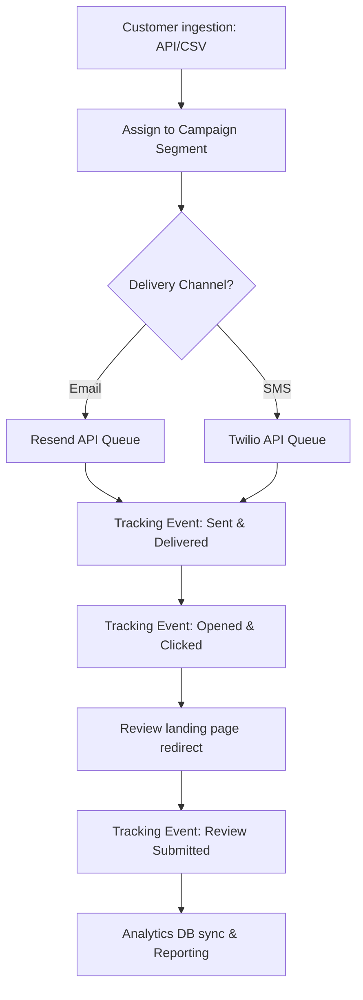

# Review Request Engine Playbook

This document defines the architecture, queues, event tracking models, delivery strategies, and analytics protocols for the Review Request Engine.

---

## 1. Review Engine Vision & Workflow

The Review Request Engine automates customer outreach to capture feedback and reviews. The workflow is designed for maximum deliverability, strict compliance, and clear ROI attribution.

### 1.1 Core Engine Lifecycle

---

## 2. Delivery Channels & Templating

Outreach is structured across two channels with distinct formatting and tracking requirements.

### 2.1 Email Review Invites
* **Template Engine**: Dynamic HTML layouts parsing business logos, custom colors, and personalized variables (e.g. `{{customer_name}}`, `{{business_name}}`).
* **Tracking Pixel**: Transparent SVG (`1x1px`) embedded in email footers to capture `Opened` events.
* **Unsubscribe Headers**: Injected `List-Unsubscribe` headers enabling one-click mail client opt-outs.

### 2.2 SMS Review Invites
* **Provider**: Twilio messaging endpoints.
* **Format Constraints**: SMS copies must fit within 160 characters (1 segment) to manage costs.
* **Link Shortener**: Custom internal URL shortener (e.g. `https://rvw.hub/t/<short_id>`) that tracks redirects and identifies the specific customer context.

---

## 3. Campaign Classification & Scheduling

Campaign configurations adapt to business styles:

* **One-Time Campaigns**: Bulk dispatch for historic customer lists.
* **Scheduled Campaigns**: Planned calendar dispatches (e.g., end-of-month review collections).
* **Post-Service Campaigns**: Automated trigger 1 to 4 hours following client appointments (integrated via CRM webhooks).
* **Post-Purchase Campaigns**: Scheduled invite triggered 3 to 7 days post product shipping to allow proper product trial.

### 3.1 Scheduling Filters
* **Time-Zone Enforcement**: Invites are dynamically scheduled based on customer address postal codes.
* **Quiet Hours / Business Hours Rule**: Outbound messages are restricted to a safe window between **9:00 AM and 8:00 PM** (customer local time). Invites triggered outside this window are buffered in Redis until the next morning.

---

## 4. Tracking Events Schema

Each invite generates a lifecycle tracking chain with unique event types:

| Event Type | Description | Source Verification |
|---|---|---|
| `Sent` | Request payload accepted by Resend/Twilio gateway. | API Response Code `202 Accepted` |
| `Delivered` | Destination SMTP server or carrier confirmed delivery receipt. | Webhook callback from provider |
| `Opened` | Customer rendered email pixel images. | Image load event logged |
| `Clicked` | Customer clicked personalized review link. | Link shortener redirect lookup |
| `Review Submitted` | Customer completed feedback form on target directory (Google/Yelp). | Callback click validation or location scraper confirmation |
| `Failed` | Bounce or invalid phone number encountered. | Provider status callback |

---

## 5. Queue Architecture (BullMQ / Redis)

All message dispatches and event ingestion processes are decoupled using a queue system:

* **Email Queue (`email-queue`)**: Handles template rendering, DNS SPF/DKIM validation audits, and Resend client calls.
* **SMS Queue (`sms-queue`)**: Processes Twilio client dispatches, carrier rate-limit queuing, and alphanumeric sender ID mappings.
* **Tracking Queue (`tracking-queue`)**: Ingests incoming webhook events (opens, clicks, carrier deliveries) to update relational database columns.
* **Webhook Queue (`webhook-queue`)**: Informs external client CRM integrations of campaign status updates.
* **Reporting Queue (`report-queue`)**: Recalculates metrics caches (e.g. business average ratings, conversion percentages) asynchronously.

---

## 6. Retry & Recovery Logic

To optimize delivery rates against temporary provider outages or rate blocks:
* **Failures Classification**:
  * **Temporary Failures** (HTTP `429 Too Many Requests`, connection timeouts): Auto-re-queued.
  * **Permanent Failures** (HTTP `400 Invalid Number`, `550 User Unknown` bounce): Instantly logged to suppression list.
* **Backoff Strategy**: Exponential backoff configured with a factor of `1.5` and a jitter coefficient.
* **Max Retry Threshold**: Maximum of `3` retries. Escalations are logged to Super Admin consoles if failures persist.

---

## 7. Opt-Out & Suppression Lists

* **Suppression Registry**: A centralized database table containing unsubscribed email hashes and SMS phone numbers.
* **Suppression Audits**: The email/SMS processor must query the suppression registry before triggering outbound SDK calls.
* **Compliance Logs**: Opt-out timestamps and methods (e.g. `SMS STOP`, `EMAIL UNSUBSCRIBE LINK`) logged for GDPR/CCPA audit readiness.

---

## 8. Conversion Metrics & Analytics

The reporting dashboard tracks campaign efficiency using five key metrics:
1. **Requests Sent**: Total invitations dispatched.
2. **Clicks Generated**: Invites where link redirect occurred.
3. **Reviews Received**: Verifiable reviews completed.
4. **Average Rating**: Cumulative score of collected reviews.
5. **Conversion Percentage**: Formula: `(Reviews Received / Requests Sent) * 100`.

---

## 9. Part 7 Deliverables Gate Checklist

* [x] Campaign orchestration workflows documented
* [x] Decentralized queue system design approved
* [x] Delivery tracking schemas finalized
* [x] Analytics KPIs defined
* [x] Review request engine ready for development
