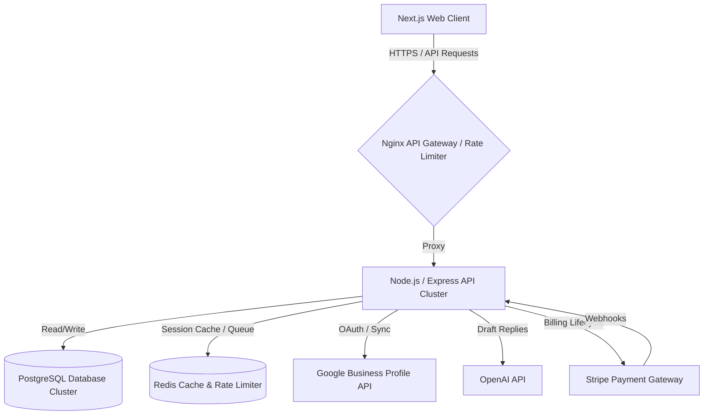
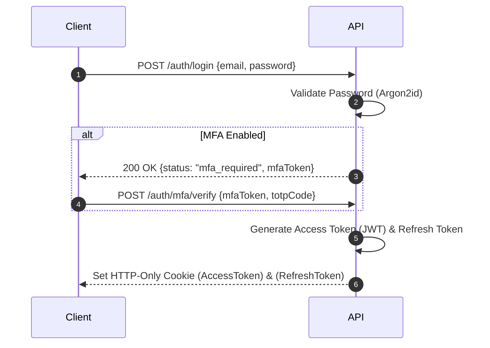
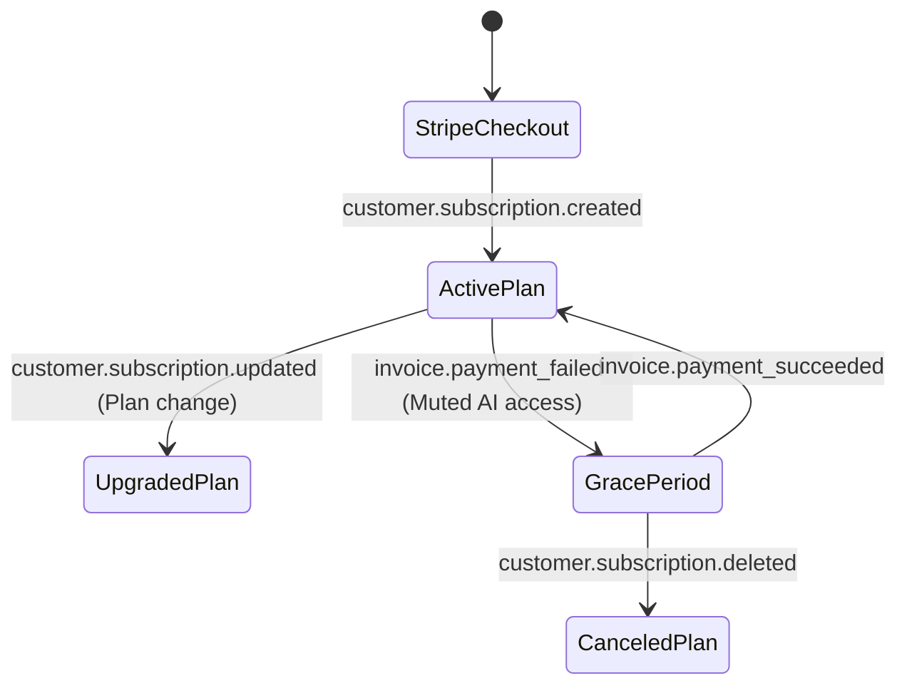

# Technical Architecture Specification — ReviewManagement

This document establishes the official system design, database schemas, REST API directory, authentication mechanisms, billing configurations, and compliance policies for the **ReviewManagement** multi-tenant SaaS platform.

---

## 1. System Architecture Overview

ReviewManagement is engineered as a modern, horizontally scalable, multi-tenant Software-as-a-Service (SaaS) application.



---

## 2. Multi-Tenant Database Design (PostgreSQL)

To achieve absolute security and isolation between customer records, the platform implements a **Shared Database, Shared Schema** architecture utilizing PostgreSQL **Row-Level Security (RLS)**.

### Tenant Isolation Strategy
Every tenant table contains an `organization_id` column. A PostgreSQL policy is enabled to automatically restrict data visibility based on the active session tenant context.

```sql
-- Example of Tenant Isolation configuration
ALTER TABLE locations ENABLE ROW LEVEL SECURITY;

CREATE POLICY location_tenant_isolation_policy ON locations
    USING (organization_id = NULLIF(current_setting('app.current_organization_id', true), '')::uuid);
```

### Table DDL Schemas

#### 1. Organizations
```sql
CREATE TABLE organizations (
    id UUID PRIMARY KEY DEFAULT gen_random_uuid(),
    slug VARCHAR(100) UNIQUE NOT NULL,
    name VARCHAR(150) NOT NULL,
    category VARCHAR(50) NOT NULL,
    description TEXT,
    phone VARCHAR(30),
    website VARCHAR(255),
    address VARCHAR(255),
    logo VARCHAR(50) DEFAULT '🏪',
    status VARCHAR(20) NOT NULL DEFAULT 'active', -- 'active', 'suspended'
    created_at TIMESTAMP WITH TIME ZONE DEFAULT CURRENT_TIMESTAMP,
    updated_at TIMESTAMP WITH TIME ZONE DEFAULT CURRENT_TIMESTAMP
);
```

#### 2. Subscriptions
```sql
CREATE TABLE subscriptions (
    id UUID PRIMARY KEY DEFAULT gen_random_uuid(),
    organization_id UUID REFERENCES organizations(id) ON DELETE CASCADE,
    plan_tier VARCHAR(30) NOT NULL DEFAULT 'starter', -- 'starter', 'growth', 'agency', 'enterprise'
    status VARCHAR(20) NOT NULL DEFAULT 'incomplete', -- 'active', 'trialing', 'past_due', 'canceled'
    stripe_customer_id VARCHAR(100) UNIQUE NOT NULL,
    stripe_subscription_id VARCHAR(100) UNIQUE,
    current_period_start TIMESTAMP WITH TIME ZONE,
    current_period_end TIMESTAMP WITH TIME ZONE,
    trial_end TIMESTAMP WITH TIME ZONE,
    created_at TIMESTAMP WITH TIME ZONE DEFAULT CURRENT_TIMESTAMP,
    updated_at TIMESTAMP WITH TIME ZONE DEFAULT CURRENT_TIMESTAMP
);
```

#### 3. Locations
```sql
CREATE TABLE locations (
    id UUID PRIMARY KEY DEFAULT gen_random_uuid(),
    organization_id UUID REFERENCES organizations(id) ON DELETE CASCADE,
    name VARCHAR(150) NOT NULL,
    address VARCHAR(255) NOT NULL,
    created_at TIMESTAMP WITH TIME ZONE DEFAULT CURRENT_TIMESTAMP,
    updated_at TIMESTAMP WITH TIME ZONE DEFAULT CURRENT_TIMESTAMP
);
```

#### 4. Users
```sql
CREATE TABLE users (
    id UUID PRIMARY KEY DEFAULT gen_random_uuid(),
    email VARCHAR(255) UNIQUE NOT NULL,
    password_hash VARCHAR(255) NOT NULL,
    name VARCHAR(100) NOT NULL,
    role VARCHAR(20) NOT NULL DEFAULT 'readonly', -- 'admin', 'agency', 'owner', 'manager', 'readonly'
    organization_id UUID REFERENCES organizations(id) ON DELETE CASCADE,
    location_id UUID REFERENCES locations(id) ON DELETE SET NULL, -- Null implies organization-wide access
    mfa_secret VARCHAR(100),
    mfa_enabled BOOLEAN NOT NULL DEFAULT FALSE,
    email_verified BOOLEAN NOT NULL DEFAULT FALSE,
    created_at TIMESTAMP WITH TIME ZONE DEFAULT CURRENT_TIMESTAMP,
    updated_at TIMESTAMP WITH TIME ZONE DEFAULT CURRENT_TIMESTAMP
);
```

#### 5. Reviews
```sql
CREATE TABLE reviews (
    id UUID PRIMARY KEY DEFAULT gen_random_uuid(),
    organization_id UUID REFERENCES organizations(id) ON DELETE CASCADE,
    location_id UUID REFERENCES locations(id) ON DELETE CASCADE,
    source VARCHAR(50) NOT NULL, -- 'Google', 'Facebook', 'TripAdvisor', 'Booking.com'
    customer_name VARCHAR(100) NOT NULL,
    customer_email VARCHAR(255),
    rating INT NOT NULL CHECK (rating >= 1 AND rating <= 5),
    text TEXT,
    reply_text TEXT,
    replied_at TIMESTAMP WITH TIME ZONE,
    replied_by VARCHAR(100),
    status VARCHAR(20) NOT NULL DEFAULT 'pending', -- 'pending', 'replied', 'flagged', 'archived'
    sentiment VARCHAR(10) NOT NULL DEFAULT 'neutral', -- 'positive', 'neutral', 'negative'
    keywords VARCHAR(50)[],
    is_urgent BOOLEAN NOT NULL DEFAULT FALSE,
    created_at TIMESTAMP WITH TIME ZONE DEFAULT CURRENT_TIMESTAMP
);
```

#### 6. Review Requests (Campaigns)
```sql
CREATE TABLE review_requests (
    id UUID PRIMARY KEY DEFAULT gen_random_uuid(),
    organization_id UUID REFERENCES organizations(id) ON DELETE CASCADE,
    location_id UUID REFERENCES locations(id) ON DELETE CASCADE,
    campaign_name VARCHAR(150) NOT NULL,
    channel VARCHAR(10) NOT NULL, -- 'email', 'sms', 'qr'
    template_subject VARCHAR(150),
    template_body TEXT NOT NULL,
    send_delay_hours INT DEFAULT 24,
    sent_count INT DEFAULT 0,
    created_at TIMESTAMP WITH TIME ZONE DEFAULT CURRENT_TIMESTAMP
);
```

#### 7. AI Replies
```sql
CREATE TABLE ai_replies (
    id UUID PRIMARY KEY DEFAULT gen_random_uuid(),
    organization_id UUID REFERENCES organizations(id) ON DELETE CASCADE,
    review_id UUID REFERENCES reviews(id) ON DELETE CASCADE,
    reply_text TEXT NOT NULL,
    tone VARCHAR(20) NOT NULL, -- 'friendly', 'professional', 'apologetic'
    approval_status VARCHAR(20) NOT NULL DEFAULT 'draft', -- 'draft', 'approved', 'sent'
    tokens_used INT DEFAULT 0,
    created_at TIMESTAMP WITH TIME ZONE DEFAULT CURRENT_TIMESTAMP
);
```

#### 8. Integrations
```sql
CREATE TABLE integrations (
    id UUID PRIMARY KEY DEFAULT gen_random_uuid(),
    organization_id UUID REFERENCES organizations(id) ON DELETE CASCADE,
    service_name VARCHAR(50) NOT NULL, -- 'google_business', 'openai', 'stripe', 'twilio', 'sendgrid'
    credentials_encrypted TEXT NOT NULL, -- AES-256 GCM encrypted JSON payloads
    is_active BOOLEAN NOT NULL DEFAULT TRUE,
    created_at TIMESTAMP WITH TIME ZONE DEFAULT CURRENT_TIMESTAMP,
    updated_at TIMESTAMP WITH TIME ZONE DEFAULT CURRENT_TIMESTAMP
);
```

#### 9. Audit Logs
```sql
CREATE TABLE audit_logs (
    id UUID PRIMARY KEY DEFAULT gen_random_uuid(),
    organization_id UUID REFERENCES organizations(id) ON DELETE SET NULL,
    user_id UUID REFERENCES users(id) ON DELETE SET NULL,
    action VARCHAR(100) NOT NULL, -- 'user_login', 'reply_submitted', 'billing_upgraded', etc.
    ip_address VARCHAR(45) NOT NULL,
    user_agent VARCHAR(255) NOT NULL,
    metadata JSONB, -- Context details of action (e.g. diff parameters)
    created_at TIMESTAMP WITH TIME ZONE DEFAULT CURRENT_TIMESTAMP
);
```

### Database Indexing & Optimizations
```sql
-- Indexes for rapid multi-tenant filtering
CREATE INDEX idx_locations_org ON locations(organization_id);
CREATE INDEX idx_users_org ON users(organization_id);
CREATE INDEX idx_reviews_org ON reviews(organization_id);
CREATE INDEX idx_reviews_location_rating ON reviews(location_id, rating);
CREATE INDEX idx_reviews_urgency ON reviews(is_urgent) WHERE is_urgent = TRUE;
CREATE INDEX idx_audit_logs_org_action ON audit_logs(organization_id, action);
```

---

## 3. REST API Architecture

### General Middleware Configuration
* **Rate Limiting**: Implemented via Redis Token Bucket algorithm.
  * Public endpoints (Auth): Max 10 requests / minute / IP.
  * Standard endpoints: Max 100 requests / minute / Authenticated User.
  * Analytics & AI endpoints: Max 30 requests / minute / Authenticated User.
* **API Versioning**: Prefixing all endpoints: `/api/v1/`.

### Core API Endpoint Schema

| Path | Method | Auth Required | Description |
|---|---|---|---|
| `/api/v1/auth/register` | POST | None | Creates a new user, organization, and draft subscription plan. |
| `/api/v1/auth/login` | POST | None | Authenticates password, checks MFA, returns JWT cookies. |
| `/api/v1/auth/mfa/verify`| POST | None | Validates TOTP code to finalize multi-factor handshake. |
| `/api/v1/users` | GET | Token | Retrieves organization team directory. |
| `/api/v1/users` | POST | Token (User Mgmt) | Invites a new team member and assigns a Role. |
| `/api/v1/locations` | POST | Token (Edit/Create)| Appends a new physical location checks subscription bounds. |
| `/api/v1/reviews` | GET | Token | Queries reviews with pagination, filter params. |
| `/api/v1/reviews/:id/reply`| POST | Token (Edit) | Commits draft reply or publishes direct response. |
| `/api/v1/ai-replies/draft`| POST | Token (Edit) | Requests OpenAI draft reply for specific review. |
| `/api/v1/subscriptions/upgrade`| POST | Token (Billing) | Initiates Stripe checkout session redirect. |
| `/api/v1/integrations/connect`| POST | Token (Billing) | Updates encrypted tokens payload. |
| `/api/v1/analytics/overview`| GET | Token | Compiles organization-wide KPI stats. |

### Payload Input Validation (Zod Schema Examples)
```typescript
import { z } from "zod";

export const CreateLocationSchema = z.object({
  name: z.string().min(2, "Location name must contain at least 2 characters."),
  address: z.string().min(5, "Address must contain a valid physical street mapping.")
});

export const AIReplyRequestSchema = z.object({
  reviewId: z.string().uuid("Invalid review reference."),
  tone: z.enum(["friendly", "professional", "apologetic"]),
  brandVoiceNotes: z.string().max(300).optional()
});
```

---

## 4. Authentication, Authorization, & Security



### Encryption & Cryptographic Standards
1. **Passwords**: Hashed using **Argon2id** (m=65536, t=3, p=4 parameters).
2. **At-Rest Storage**: Encrypted using AES-256 transparent block encryption on PostgreSQL volume.
3. **Secret Credentials**: Keys for Twilio, SendGrid, and OpenAI are encrypted using **AES-256-GCM** with a rotating master key stored securely in environment secret values.

---

## 5. Stripe Billing Integration

### Mapped Webhook Events



* **`customer.subscription.created`**:
  * Action: Locate Organization matching Stripe metadata email; set plan status to `active` and populate Stripe identifiers in the database.
* **`customer.subscription.updated`**:
  * Action: Read new plan tier from webhook item structure, update `plan_tier` bounds dynamically.
* **`invoice.payment_failed`**:
  * Action: Fire automated retry warning email. Set account status to `past_due` with a 7-day grace period. Mute AI features and location additions immediately.
* **`customer.subscription.deleted`**:
  * Action: Suspend account actions, demote location config to 1, lock dashboard access.

---

## 6. Audit Logging & Compliance Policies

### Immutable Logging
Audit logs are strictly **Insert-Only**. Data tables contain trigger configurations that block update or delete events.

```sql
CREATE RULE audit_logs_immutable AS ON UPDATE TO audit_logs DO INSTEAD NOTHING;
CREATE RULE audit_logs_undeletable AS ON DELETE TO audit_logs DO INSTEAD NOTHING;
```

### Retention Policies

| Data Category | Retention Limit | Disposal Enforcement |
|---|---|---|
| **Reviews & Customer Input**| Indefinite | Kept to fuel historical comparative charts. Removed only upon business account deletion. |
| **Audit Logs** | 12 Months | Archived off-line to long-term cold storage before cleanup. |
| **User Activity Records** | 12 Months | Soft purge from cache logs. |
| **Billing & Invoice Logs** | 7 Years | Kept to comply with IRS regulatory standards. |

---

## 7. Performance & Technical KPIs

To maintain high scalability, we commit to the following performance bounds:
* **API Route Response Time**: Average latency `< 150ms` (95th percentile `< 300ms`).
* **Database Performance**: Query read indexes coverage `> 98%`, connection pool latency `< 10ms`.
* **Error Rate**: Global application errors `< 0.1%` of all API traffic.
* **Availability Target**: SLA commitment of `99.9%` monthly uptime.
